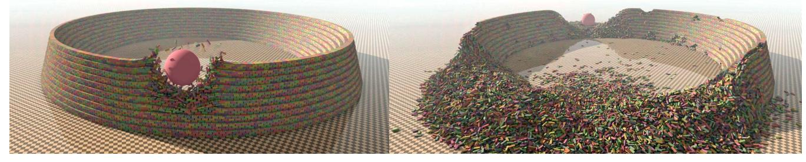
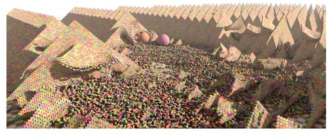

# Crazy Fast Physics! Augmented Vertex Block Descent in Action!

[Chris Giles](https://orcid.org/0009-0009-1502-3487) Independent San Mateo, CA, USA cgiles17@gmail.com

[Elie Diaz](https://orcid.org/0009-0002-9493-1684) University of Utah Salt Lake City, UT, USA elie.diaz@utah.edu

[Cem Yuksel](https://orcid.org/0000-0002-0122-4159) University of Utah Salt Lake City, UT, USA cem@cemyuksel.com

Figure 1: Augmented vertex block descent allows faster physics simulations than ever before! It offers an efficient way of handling hard constraints, which is critical for simulating contacts and stacking. In this example, a sphere smashes a pile of 110,000 blocks, simulated using only 4 iterations per frame, though the pile has 40 levels! It is balanced by frictional contacts alone, so the whole structure begins to collapse after the initial impact. It only takes 3.5 ms (9.8 ms including collision detection) per frame to fully simulate this scene on an NVIDIA RTX 4090 GPU.

#### ACM Reference Format:

Chris Giles, Elie Diaz, and Cem Yuksel. 2025. Crazy Fast Physics! Augmented Vertex Block Descent in Action!. In Special Interest Group on Computer Graphics and Interactive Techniques Conference Real-Time Live! (SIGGRAPH Real-Time Live! '25), August 10–14, 2025, Vancouver, BC, Canada. ACM, New York, NY, USA, [2](#page-1-0) pages. <https://doi.org/10.1145/3721243.3735982>

### 1 Introduction

We demonstrate the power of the Augmented Vertex Block Descent (AVBD) [\[Giles et al.](#page-1-1) [2025\]](#page-1-1) method for physics simulation with unprecedented performance. AVBD is designed to handle a large number of objects (or degrees of freedom) connected with various constraints, including articulated joints, complex collisions, friction, and stacking. It not only delivers unconditional numerical stability but also superior computational performance and substantially improved numerical accuracy, as compared to prior methods.

AVBD extends the vertex block descent (VBD) [\[Chen et al.](#page-1-2) [2024\]](#page-1-2) method, which presented superior performance than prior methods and unconditional stability in the context of soft body simulation. Our Augmented VBD method includes an Augmented Lagrangian formulation for handling hard constraints with VBD. These hard constraints are essential for properly handling contacts and stacking scenarios, which are essential for rigid-body simulations.

Our demos include large scenes with over a million objects, interacting with each other via joint constraints and frictional contacts, all simulated via AVBD at real-time frame rates on the GPU. We also show scenes that include long articulated chains and objects with

Permission to make digital or hard copies of all or part of this work for personal or classroom use is granted without fee provided that copies are not made or distributed for profit or commercial advantage and that copies bear this notice and the full citation on the first page. Copyrights for third-party components of this work must be honored. For all other uses, contact the owner/author(s).

SIGGRAPH Real-Time Live! '25, Vancouver, BC, Canada © 2025 Copyright held by the owner/author(s). ACM ISBN 979-8-4007-1545-7/25/08

<https://doi.org/10.1145/3721243.3735982>

large mass ratios interacting with each other, which are particularly challenging cases to simulate using prior methods.

# 2 Vertex Block Descent

VBD provides an efficient and numerically stable solution for an optimization problem that provides the solution of an implicit Euler time integration. More specifically, VBD solves the variational form of implicit Euler via position updates. VBD computes the positions at the end of the time step x +Δ by solving

$$
\mathbf{x}^{t+\Delta t} = \underset{\mathbf{x}}{\text{argmin}} \; \frac{1}{2\,\Delta t^2} \|\mathbf{x} - \mathbf{y}\|_M^2 + E(\mathbf{x}) \;, \tag{1}
$$

where Δ is the timestep size, y is the inertial positions, ∥·∥ represent mass-weighted norm, and (x) is the total potential energy evaluated at positions x. The inertial positions y are calculated using the positions x and velocities v at the beginning of the timestep, such that

$$
y = xt + \Delta t vt + \Delta t2 aext , \t\t(2)
$$

where aext represent the external acceleration, such as gravity. The total potential energy (x) is the sum of the energies of all force elements, including material deformations and collisions.

VBD solves this optimization problem using Gauss-Seidel iterations. Each iteration, updates x by modifying the position x of one vertex at a time, keeping all other vertices of a deformable object fixed at their latest positions. When no other vertex moves, the minimization in [Equation 1](#page-0-0) is equivalent to a local minimization that only modifies x , such that

$$
\mathbf{x}_{i} \leftarrow \operatorname*{argmin}_{\mathbf{x}_{i}} \frac{1}{2 \Delta t^{2}} ||\mathbf{x}_{i} - \mathbf{y}_{i}||_{\mathbf{M}_{i}}^{2} + \sum_{j \in \mathcal{F}_{i}} E_{j}(\mathbf{x}) , \qquad (3)
$$

where M is the mass matrix and is the energy of a force element in the set F of all force elements that use x . All other force elements can be ignored here, since all other vertex positions are fixed while updating the position x .

SIGGRAPH Real-Time Live! '25, August 10–14, 2025, Vancouver, BC, Canada Chris Giles, Elie Diaz, and Cem Yuksel

VBD solves [Equation 3](#page-0-1) using a single Newton iteration, which corresponds to solving the linear system

$$
\mathbf{H}_i \Delta \mathbf{x}_i = \mathbf{f}_i \tag{4}
$$

where Δ is the position change between iterations, f is the force

$$
\mathbf{f}_i = -\frac{1}{\Delta t^2} \mathbf{M}_i (\mathbf{x}_i - \mathbf{y}_i) + \sum_{J \in \mathcal{F}_i} \mathbf{f}_{ij} , \qquad (5)
$$

calculated using f = − (x)/x , and H is the Hessian

$$
\mathbf{H}_{i} = \frac{\mathbf{M}_{i}}{\Delta t^{2}} + \sum_{J \in \mathcal{F}_{i}} \mathbf{H}_{ij} ,
$$
 (6)

such that H = 2 ()/x 2 is the Hessian of each force element acting on vertex .

Since vertices have 3 degrees of freedom (DOF), H and M = I are 3 × 3 matrices, where is the mass of the vertex and I is the identity matrix. The same goes for simulating particles with 3 DOF. 

When simulating rigid bodies with 6 DOF, x = [p q,v] includes both the positions p and quaternions q = (,s, q,v) that represent the orientations, where ,s and q,v are the scalar and vector components. Since q is a unit quaternion, ,s can be safely omitted and the 6D subtraction operation can be defined as

$$
\mathbf{x}_i - \mathbf{x}_j := \begin{bmatrix} \mathbf{p}_i - \mathbf{p}_j \\ (2\mathbf{q}_i \mathbf{q}_j^{-1})_{\mathbf{v}} \end{bmatrix} . \tag{7}
$$

In this case, H and M are 6 × 6 matrices, such that

$$
\mathbf{M}_i = \begin{bmatrix} m_i \mathbf{I} & \mathbf{0} \\ \mathbf{0} & \mathbf{I}_i \end{bmatrix}, \tag{8}
$$

where the 3 × 3 matrices I, 0, and I represent the identity matrix, zero matrix, and the rotated moment of the rigid body, respectively. Similarly, Δx = [Δp Δw] contains a position Δp and an orientation Δw component and the resulting update is defined as

$$
\mathbf{x}_{i} + \Delta \mathbf{x}_{i} := \begin{bmatrix} \mathbf{p}_{i} + \Delta \mathbf{p}_{j} \\ \text{normalize} \left( \mathbf{q}_{i} + \frac{1}{2} (0, \Delta \mathbf{w}_{i}) \mathbf{q}_{i} \right) \end{bmatrix} . \tag{9}
$$

### 3 Augmented Vertex Block Descent

In VBD, constraints can be modeled by a quadratic energy potential

$$
E_j(\mathbf{x}) = \frac{1}{2}k_j \left( C_j(\mathbf{x}) \right)^2, \tag{10}
$$

where and are the stiffness and the constraint error for constraint , respectively. However, this does not work for hard constraints with infinite stiffness. Therefore, AVBD uses augmented Lagrangian to represent the energy for each iteration as

$$
E_j(\mathbf{x}) = \frac{1}{2} k_j^{(n)} \left( C_j(\mathbf{x}) \right)^2 + \lambda_j^{(n)} C_j(\mathbf{x}), \qquad (11)
$$

where () is the finite stiffness and () the dual variable of the constraint, which are updated after each iteration, starting with

$$
k_j^{(0)} = k_{\text{start}} \qquad \text{and} \qquad \lambda_j^{(0)} = 0 , \qquad (12)
$$

where start > 0 is an initial stiffness parameter, and using

$$
\lambda_j^{(n+1)} = k_j^{(n)} C_j(\mathbf{x}) + \lambda_j^{(n)}
$$
(13)

$$
k_j^{(n+1)} = k_j^{(n)} + \beta |C_j(\mathbf{x})| \,, \tag{14}
$$

where is a parameter that controls the stiffness increment rate.

Figure 2: 510,000 blocks smashed by two spheres, simulated with AVBD using 4 iterations per frame (10.3 ms on NVIDIA RTX 4090).

Using hard constrains, the Hessian H can easily become noninvertible. To avoid this, AVBD approximates the Hessians using

$$
\mathbf{H}_{ij} \approx k_j^{(n)} \left( \frac{\partial C_j(\mathbf{x})}{\partial \mathbf{x}_i} \right)^T \frac{\partial C_j(\mathbf{x})}{\partial \mathbf{x}_i} + \tilde{\mathbf{G}}_{ij}
$$
(15)

where the second term G˜ is a diagonal matrix that approximates

$$
G_{ij}(\mathbf{x}) = \left(k_j^{(n)}C_j(\mathbf{x}) + \lambda_j^{(n)}\right) \frac{\partial^2 C_j(\mathbf{x})}{\partial \mathbf{x}_i^2},\tag{16}
$$

such that each diagonal element , of G˜ is the norm of the vector G, that forms the column of G , such that , = ∥G, ∥.

In real-time simulations, it is typical to use a limited number of iterations, instead of iterating until the constraint error is removed. Unfortunately, with hard constraints, the resulting error can inject an arbitrary amount of energy into the system due to position correction. AVBD limits this using (x) = ∗ (x) − ∗ (x ), where ∗ is the original constraint function and ∈ [0, 1] is the user-specified regularization parameter.

The convergence rate of AVBD can be significantly improved by warm starting the stiffness and dual variables using

$$
k_j^{(0)} = \max\left(\gamma k_j^t, \ k_{\text{start}}\right) \qquad \text{and} \qquad \lambda_j^{(0)} = \alpha \gamma \lambda_j^t \qquad (17)
$$

where and are the ones computed after the last iteration of the previous frame, and ∈ [0, 1) is the scaling parameter.

The user-defined parameters of AVBD do not need to be finetuned. We use = 0.95, = 10, and = 0.99 for all examples.

# 4 Conclusion

AVBD offers real-time physics simulation with an unprecedented level of performance (Figures [1](#page-0-2) & [2\)](#page-1-3). It inherits the unconditional stability and the parallel computing power of VBD. It allows extreme mass variations and, unlike VBD, it can handle extreme stiffness ratios. AVBD's formulation is essential for properly resolving frictional contacts and stacking, in addition to simulations of articulated objects with arbitrary joints and attachment constraints. Most notably, AVBD can simulate stable stacking of large piles and long articulated chains with only a few iterations per frame.

# References

- Anka He Chen, Ziheng Liu, Yin Yang, and Cem Yuksel. 2024. Vertex Block Descent. ACM Transactions on Graphics (Proceedings of SIGGRAPH 2024) 43, 4, Article 116 (07 2024), 16 pages. [doi:10.1145/3658179](https://doi.org/10.1145/3658179)
- Chris Giles, Elie Diaz, and Cem Yuksel. 2025. Augmented Vertex Block Descent. ACM Transactions on Graphics (Proceedings of SIGGRAPH 2025) 44, 4 (08 2025), 12 pages. [doi:10.1145/3731195](https://doi.org/10.1145/3731195)