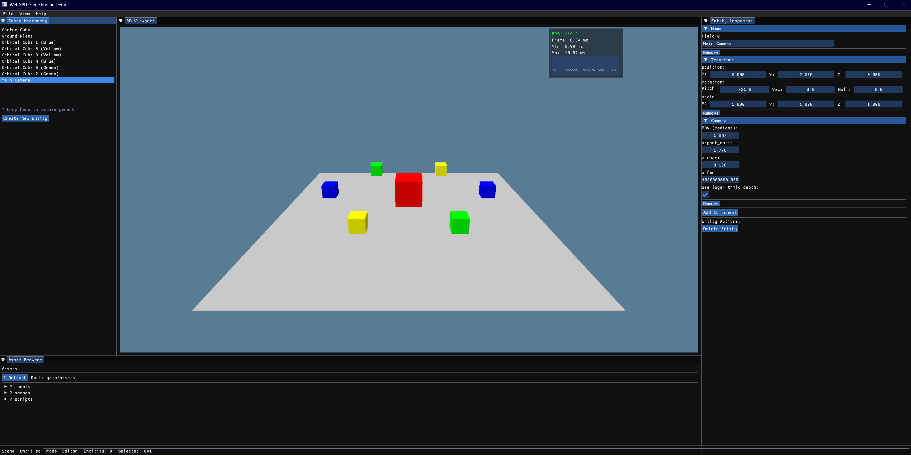

# WebGPU Engine 🎮

[](https://github.com/eliasstepanik/webgpu-engine/actions/workflows/ci.yml)
[](LICENSE)
<!-- Future badges when published:
[](https://crates.io/crates/webgpu-engine)
[](https://docs.rs/webgpu-engine)
-->

> A modern, modular 3D game engine built with Rust and WebGPU, featuring an ImGui-based editor with automatic UI generation and Rhai scripting.



## ✨ Features

- 🚀 **Modern Rendering** - WebGPU-based pipeline with WGSL shaders and per-object transforms
- 🎯 **Entity Component System** - Efficient ECS using hecs with transform hierarchy and cycle detection
- 🖼️ **ImGui Editor** - Feature-rich editor with automatic component UI generation
- 📜 **Rhai Scripting** - Hot-reloadable scripts with dynamic properties and mesh generation
- 📦 **Scene System** - JSON-based scene serialization with component registry
- 🏗️ **Modular Architecture** - Clean separation of engine, editor, game, and derive macros
- 🌍 **Large World Support** - Dual transform system for galaxy-scale coordinates
- 🎨 **Component UI System** - Automatic inspector UI via derive macros with rich metadata
- ⚡ **Physics System** - Integrated Rapier3D physics with f64 precision for large worlds

## 🚀 Quick Start

### Prerequisites

- **Rust**: 1.75 or later
- **GPU**: Modern GPU with WebGPU support (Vulkan/Metal/DX12)
- **OS**: Windows, macOS, or Linux

### Getting Started

1. **Clone the repository**:
   ```bash
   git clone https://github.com/eliasstepanik/webgpu-engine.git
   cd webgpu-engine
   ```

2. **Run the engine**:
   ```bash
   just run
   ```

3. **What you'll see**: The engine will launch with the ImGui editor showing:
   - Hierarchy panel with scene entities
   - 3D viewport with rendered scene
   - Inspector panel for component editing
   - Assets panel for resource management

> **Note**: Press `Tab` to toggle between Editor UI mode and Game input mode.

## 🏛️ Architecture

```
┌─────────────────┐  ┌─────────────────┐  ┌─────────────────┐
│                 │  │                 │  │                 │
│  Game (binary)  │  │     Editor      │  │  Engine (lib)   │
│                 │  │   (optional)    │  │                 │
│  • Entry point  │  │  • ImGui UI     │  │  • ECS (hecs)   │
│  • Window setup │  │  • Panels       │  │  • Rendering    │
│  • Main loop    │  │  • Inspector    │  │  • Scripting    │
│                 │  │                 │  │  • Components   │
└────────┬────────┘  └────────┬────────┘  └────────┬────────┘
         │                    │                     │
         └────────────────────┴─────────────────────┘
                              │
                   ┌──────────┴──────────┐
                   │   Engine Derive     │
                   │  • Component macro  │
                   │  • EditorUI macro   │
                   └─────────────────────┘
```

### Crate Structure

| Crate | Type | Purpose |
|-------|------|---------|
| `engine` | Library | Core systems: ECS, rendering, scripting, I/O |
| `editor` | Library | ImGui-based editor (included in dev builds) |
| `game` | Binary | Application entry point and windowing |
| `engine_derive` | Library | Procedural macros for components |

For detailed architecture information, see [PLANNING.md](PLANNING.md).

## 📚 Key Features

### Entity Component System

Built on `hecs`, the ECS provides efficient entity management with automatic hierarchy updates:

```rust
use engine::prelude::*;

// Define a component with automatic UI
#[derive(Component, EditorUI)]
pub struct Velocity {
    #[ui(range = -10.0..10.0, speed = 0.1)]
    pub x: f32,
    #[ui(range = -10.0..10.0, speed = 0.1)]
    pub y: f32,
}

// Create an entity
let entity = world.spawn((
    Transform::from_position(Vec3::new(0.0, 1.0, 0.0)),
    Velocity { x: 1.0, y: 0.0 },
    Name("Player".to_string()),
));
```

### Rhai Scripting

Scripts can access the ECS and create dynamic behaviors:

```rust
// scripts/rotating_cube.rhai
fn on_start() {
    print("Cube rotation started!");
}

fn on_update(delta_time) {
    let transform = get_component("Transform");
    let rotation_speed = 1.0;
    
    // Rotate around Y axis
    transform.rotation = rotate_y(transform.rotation, rotation_speed * delta_time);
    set_component("Transform", transform);
}
```

### Scene Serialization

Scenes are stored as JSON with full component data:

```json
{
  "entities": [
    {
      "components": {
        "Transform": {
          "position": [0.0, 0.0, 5.0],
          "rotation": [0.0, 0.0, 0.0, 1.0],
          "scale": [1.0, 1.0, 1.0]
        },
        "Camera": {
          "fov_y_radians": 0.785398,
          "aspect_ratio": 1.777778,
          "z_near": 0.1,
          "z_far": 1000.0
        },
        "Name": "Main Camera"
      }
    }
  ]
}
```

### Large World Support

For galaxy-scale scenes, use the high-precision transform:

```rust
// Use WorldTransform for positions beyond 1 million units
world.spawn((
    WorldTransform::from_position(DVec3::new(1_000_000_000.0, 0.0, 0.0)),
    Name("Distant Star".to_string()),
));
```

### Physics System

The engine includes a fully integrated physics system powered by Rapier3D with f64 precision:

```rust
// Create a physics-enabled entity
world.spawn((
    Transform::from_position(Vec3::new(0.0, 5.0, 0.0)),
    RigidBody::Dynamic,
    Collider::cuboid(1.0, 1.0, 1.0),
    PhysicsVelocity::default(),
    PhysicsMass::new(1.0),
));

// Script-based physics control
// physics_control.rhai
fn on_update(delta_time) {
    // Apply forces and impulses
    physics::apply_force(Vec3::create(0.0, 10.0, 0.0));
    
    if input::is_key_pressed("Space") {
        physics::apply_impulse(Vec3::create(0.0, 5.0, 0.0));
    }
}
```

Physics features:
- **High Precision**: f64 coordinates for large world support
- **Component-Based**: RigidBody, Collider, PhysicsVelocity, PhysicsMass components
- **Script Integration**: Full physics API available in Rhai scripts
- **Editor Support**: Physics components appear automatically in the inspector
- **Debug Visualization**: Optional physics debug rendering

## 🛠️ Development

### Build Commands

| Command | Description |
|---------|-------------|
| `just run` | Run the game with editor (development mode) |
| `just run-editor` | Run with editor explicitly enabled |
| `just run-prod` | Run without editor (production build) |
| `just build` | Build all crates |
| `just preflight` | Run format, clippy, tests, and docs |
| `just test` | Run all tests |

### Project Structure

```
.
├── engine/           # Core engine library
│   ├── src/
│   │   ├── component_system/  # Component infrastructure
│   │   ├── core/             # ECS, transforms, camera
│   │   ├── graphics/         # WebGPU rendering
│   │   ├── scripting/        # Rhai integration
│   │   └── ...
├── editor/           # ImGui editor
├── game/            # Game executable
│   └── assets/      # Game resources
│       ├── models/  # 3D models (.obj)
│       ├── scenes/  # Scene files (.json)
│       └── scripts/ # Rhai scripts (.rhai)
└── examples/        # Layout configurations
```

### Testing

Run tests with specific scene:
```bash
SCENE=test_mesh_generation cargo run
```

## 🎮 Examples

### Running Example Scenes

The `game/assets/scenes/` directory contains several example scenes:

- `main_scene.json` - Basic setup with camera and objects
- `scripted_demo.json` - Demonstrates Rhai scripting
- `large_world_test.json` - Shows large world coordinates
- `test_mesh_generation.json` - Dynamic mesh generation

To run a specific scene:
```bash
SCENE=scripted_demo just run
```

### Editor Layouts

The editor supports multiple layout configurations in the `examples/` directory:

- `minimal_layout.json` - Essential panels only
- `developer_layout.json` - Full development setup
- `artist_layout.json` - Focus on viewport and assets

## 🤝 Contributing

We welcome contributions! Please follow these guidelines:

1. **Code Style**: Run `just preflight` before committing
2. **Commits**: Use conventional commits (feat:, fix:, docs:, etc.)
3. **Testing**: Add tests for new features
4. **Documentation**: Update relevant docs

For AI-assisted development guidelines, see [CLAUDE.md](CLAUDE.md).

## 📄 License

This project is licensed under either of:

- MIT License ([LICENSE-MIT](LICENSE-MIT) or http://opensource.org/licenses/MIT)
- Apache License, Version 2.0 ([LICENSE-APACHE](LICENSE-APACHE) or http://www.apache.org/licenses/LICENSE-2.0)

at your option.

## 🙏 Acknowledgments

Built with:
- [wgpu](https://github.com/gfx-rs/wgpu) - WebGPU implementation
- [hecs](https://github.com/Ralith/hecs) - Entity Component System
- [imgui-rs](https://github.com/imgui-rs/imgui-rs) - Immediate mode GUI
- [Rhai](https://github.com/rhaiscript/rhai) - Embedded scripting

---

<p align="center">
  Made with ❤️ and 🦀
</p>